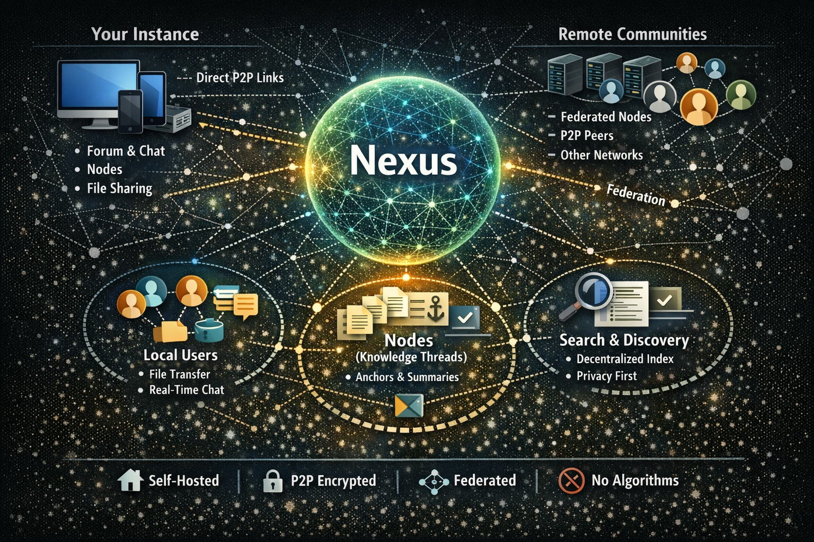

<div align="center">
  

  <p><em>"The network is the people."</em></p>

  <p><strong>Self-hosted, open-source, decentralized community platform.<br/>Forum + real-time chat + voice channels — on your own server, under your own control.</strong></p>

  [](CHANGELOG.md)
  [](https://www.gnu.org/licenses/agpl-3.0)
  [](https://github.com/Pokled/Nexus/actions/workflows/ci.yml)
  [](docs/en/ARCHITECTURE.md)
</div>

---

> **[→ Live demo: pokled.ddns.net](https://pokled.ddns.net)** *(self-hosted instance — may occasionally be offline)*

> ⚠️ **Alpha stage** — Forum, real-time chat, and voice channels are functional. P2P federation, global directory, and mobile apps are still in development. Not yet recommended for large-scale production use.

---

## Why Nexus?

Discord, Facebook and Slack locked millions of communities into private silos.
Discussions, tutorials, collective knowledge — invisible to Google, inaccessible without an account, doomed to disappear when the platform closes.

**Nexus fixes that.**

- **Self-hosted** — runs on a Raspberry Pi, a €3 VPS, or your own server
- **One instance = one community** — no multi-tenant platform, no data sharing
- **P2P by design** — no central point of failure
- **Forum indexed by Google** — your knowledge belongs to the internet
- **Real-time chat + voice** — WebRTC P2P mesh, self-hosted TURN relay
- **Open source** — AGPL-3.0, forever

<div align="center">
  
  <p><em>Your instance. Your users. Your data. No central server.</em></p>
</div>

---

## Screenshots

<table>
  <tr>
    <td align="center"><b>Community Home</b></td>
    <td align="center"><b>Forum</b></td>
  </tr>
  <tr>
    <td></td>
    <td></td>
  </tr>
  <tr>
    <td align="center"><b>Real-time Chat</b></td>
    <td align="center"><b>Voice Channels — WebRTC P2P</b></td>
  </tr>
  <tr>
    <td></td>
    <td></td>
  </tr>
  <tr>
    <td align="center"><b>Admin Panel</b></td>
    <td align="center"><b>Instance Directory</b></td>
  </tr>
  <tr>
    <td></td>
    <td></td>
  </tr>
</table>

---

## How Nexus compares

|  | **Nexus** | Discord | Matrix | Discourse | Lemmy | NodeBB |
|---|:---:|:---:|:---:|:---:|:---:|:---:|
| Self-hosted | ✅ | ❌ | ✅ | ✅ | ✅ | ✅ |
| Forum indexed by Google | ✅ | ❌ | ❌ | ✅ | ✅ | ✅ |
| Real-time chat | ✅ | ✅ | ✅ | ⚠️ | ❌ | ❌ |
| Voice channels | ✅ | ✅ | ✅ | ❌ | ❌ | ❌ |
| Screen sharing | ✅ | ✅ | ✅ | ❌ | ❌ | ❌ |
| P2P voice (no Big Tech relay) | ✅ | ❌ | ❌ | ❌ | ❌ | ❌ |
| No account required to read | ✅ | ❌ | ❌ | ✅ | ✅ | ✅ |
| Open source | ✅ AGPL | ❌ | ✅ Apache | ✅ GPL | ✅ AGPL | ✅ GPL |
| Forum + Chat + Voice in one | ✅ | ⚠️ | ❌ | ❌ | ❌ | ❌ |

> Nexus is the only self-hosted platform combining an **indexed forum**, **real-time chat**, and **P2P voice** in a single install.
> Matrix has chat+voice but no indexed forum. Discourse has forum+chat but no voice.

---

## Stack

| Layer | Technology |
|---|---|
| API | TypeScript + Fastify v5 |
| Database | PostgreSQL 16 |
| Cache / Sessions | Redis 7 |
| Full-text search | PostgreSQL FTS (tsvector + GIN) |
| Frontend | SvelteKit 5 + Tailwind v4 |
| Editor | TipTap (WYSIWYG) |
| Real-time | Socket.IO |
| Voice | WebRTC P2P mesh |
| TURN relay | node-turn (self-hosted) |

---

## Quick Start

### Docker (recommended)

```bash
git clone https://github.com/Pokled/Nexus.git
cd Nexus/nexus-core
cp .env.example .env
# Edit .env with your community settings
docker-compose up -d
```

### Manual install

See [docs/en/README.md](docs/en/README.md) for the full English installation guide (Docker, Windows, Linux/Mac).
French guide: [docs/fr/README.md](docs/fr/README.md)

---

## Project Status

| Feature | Status |
|---|---|
| Forum (categories, threads, posts, reactions, tags) | ✅ Done |
| Full-text search (PostgreSQL FTS) | ✅ Done |
| Real-time chat (Socket.IO) | ✅ Done |
| Voice channels (WebRTC P2P) | ✅ Done |
| Screen sharing | ✅ Done |
| Admin panel | ✅ Done |
| SEO (sitemap, RSS, JSON-LD) | ✅ Done |
| Self-hosted TURN server | ✅ Done |
| Meilisearch | ⏳ Phase 2 |
| Instance directory | ⏳ Phase 2 |
| WireGuard P2P mesh | ⏳ Phase 3 |
| Mobile (Capacitor) / Desktop (Tauri) | ⏳ Phase 5 |

---

## Documentation

| Language | Docs |
|---|---|
| 🇫🇷 Français | [docs/fr/](docs/fr/) |
| 🇬🇧 English | [docs/en/](docs/en/) |
| 🇪🇸 Español | *coming soon* |
| 🇮🇹 Italiano | *coming soon* |
| 🇩🇪 Deutsch | *coming soon* |

- [Manifesto](docs/en/MANIFESTO.md) — Why Nexus exists
- [Architecture](docs/en/ARCHITECTURE.md) — How it's built
- [Roadmap](docs/en/ROADMAP.md) — Where we're going
- [Contributing](docs/en/CONTRIBUTING.md) — How to contribute
- [Audio Engine](docs/en/AUDIO.md) — Broadcast EQ, RNNoise, audio chain explained
- [Neural Engine](docs/en/NEURAL-ENGINE.md) — Local AI with Ollama
- [Specs](docs/specs/) — Functional specifications (FR) / [EN](docs/en/specs/)

---

## Contributing

Nexus belongs to its community. All contributions are welcome.

1. Browse [open Issues](https://github.com/Pokled/Nexus/issues) or start a [Discussion](https://github.com/Pokled/Nexus/discussions)
2. Read [CONTRIBUTING.md](docs/en/CONTRIBUTING.md) before opening a PR
3. Commits follow [Conventional Commits](https://www.conventionalcommits.org/), written in **English**

Where to contribute freely — no validation required:

```
nexus-plugins/    →  Build plugins
nexus-themes/     →  Build themes
docs/             →  Improve or translate documentation
i18n/             →  Translate into your language
```

The **core** (`nexus-core/src/`) requires discussion first — open an Issue.

---

## License

**AGPL-3.0** — If Nexus ever betrays its principles, this license explicitly allows
anyone to fork the project and continue it in the spirit of the [Manifesto](docs/en/MANIFESTO.md).

---

*Born February 18, 2026. "Fork us if we betray you."*
